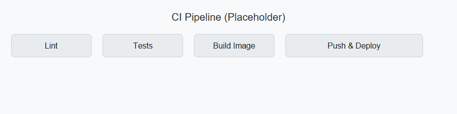
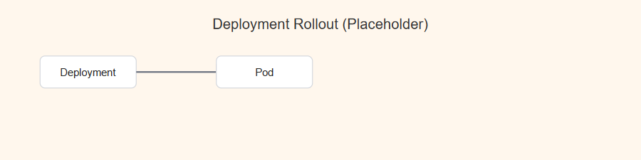
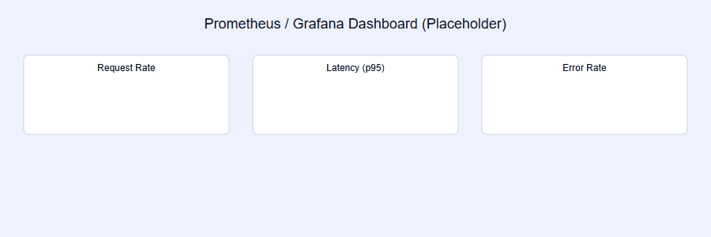

# Heart Disease Prediction — Project Report

## Overview

This repository implements a FastAPI service for predicting heart disease from structured patient data, trained and packaged with scikit-learn and deployed via Docker and Kubernetes. The project includes monitoring (Prometheus metrics), structured JSON logging, and CI/CD-ready manifests.

## Contents
- Code: `api/`, `src/`, `src/model packaging & reprd.py`
- Data: `data/raw/`, `data/processed/`
- Models: `models/model_pipeline.pkl`
- Docker and k8s manifests: `Dockerfile`, `k8s/` and `deployment/`
- Tests: `tests/`
- Screenshots: `screenshots/`

---

## Setup & Install Instructions

Prerequisites: Docker, kubectl (for local Kubernetes), Python 3.9+ (conda recommended).

1. Create the project conda env (optional):

```bash
conda create -n heart-api python=3.9 -y
conda activate heart-api
pip install -r requirements.txt
```

2. Run locally (development):

```bash
# from repo root
uvicorn api.main:app --host 0.0.0.0 --port 8001
# then
curl http://127.0.0.1:8001/health
curl http://127.0.0.1:8001/metrics
```

3. Build production image:

```bash
docker build -t heart-api:1.0 .
```

4. Deploy to local Kubernetes (Docker Desktop):

```bash
kubectl apply -f k8s/deployment.yaml
kubectl apply -f k8s/service.yaml
kubectl apply -f k8s/ingress.yaml    # if using ingress
```

5. Prometheus (local): use the provided `prometheus.yml` or ServiceMonitor if using the Prometheus Operator. The API exposes `/metrics`.

---

## Data, EDA & Modelling Choices

- Dataset: coronary heart disease dataset (provided in `data/raw/heart.csv`). Cleaned/preprocessed csv at `data/processed/heart_cleaned.csv`.
- EDA: key distributions examined (age, chol, thalach). Correlations used to inform feature selection — numeric columns standardized: `age`, `trestbps`, `chol`, `thalach`, `oldpeak`.
- Model: RandomForestClassifier with a preprocessing pipeline (StandardScaler for numeric features) saved as `models/model_pipeline.pkl`.
- Rationale: pipeline ensures consistent preprocessing at training and inference. Random forest chosen for robustness and interpretability of feature importance.

### EDA screenshots


---

## Experiment Tracking Summary

- Experiments were tracked with MLflow (see `mlruns/` folder). Tracked artifacts include model artifacts, `roc_curve.png`, and `feature_importance.png`.
- Notable metrics: accuracy and ROC AUC saved in MLflow runs located under `mlruns/`.

---

## Packaging & Deployment

- `Dockerfile` builds a slim Python image, installs pinned production dependencies, copies the app, and runs `uvicorn` as a non-root user.
- Kubernetes manifests provided under `k8s/` include liveness and readiness probes targeting `/health`, resource requests/limits, and service annotations for Prometheus scraping.

**Key deployment commands**

```bash
# build and push (if using remote registry)
docker build -t <registry>/heart-api:1.0 .
docker push <registry>/heart-api:1.0
# update deployment
kubectl set image deployment/heart-api heart-api-container=<registry>/heart-api:1.0
```

---

## Observability (Logging & Metrics)

- Structured JSON logging with `python-json-logger` (configured in `api/main.py`).
- Prometheus metrics: request count and latency exposed via `/metrics` (implemented with `prometheus_client`).
- Local verification steps:

```bash
# run the app locally then
curl http://127.0.0.1:8001/metrics
# or, when deployed, ensure Prometheus scrapes the service target
```

---

## Architecture Diagram

```mermaid
graph LR
  A[Users / Clients] -->|HTTP| B[Ingress / Service]
  B --> C[FastAPI app (Pod)]
  C --> D[Model artifact on FS]
  C --> E[Prometheus scrape /metrics]
  C --> F[Logging -> stdout]
```

Place the final, high-resolution architecture image in `screenshots/architecture.png` and replace this mermaid block if desired.

---

## CI/CD & Deployment Workflow (screenshots)

- Include screenshots of GitHub Actions or Jenkins pipeline runs in `screenshots/ci_cd/`.
- Recommended pipeline steps: lint, tests, build image, push image, deploy to cluster.

**Included screenshots:**

- `screenshots/ci_cd/ci_pipeline.png` — CI pipeline steps (lint/tests/build/deploy).
- `screenshots/ci_cd/deployment_rollout.png` — Deployment and pod rollout illustration.
- `screenshots/ci_cd/prometheus_dashboard.png` — Prometheus/Grafana dashboard placeholders to be replaced with real screenshots.







---

## Tests & Quality

- Unit tests located in `tests/` covering preprocessing and model inference.
- Run tests:

```bash
pytest -q
```

---

## Results & Validation

- The service exposes `/predict` for inference; example payload listed in `tests/test_model.py`.
- Model performance metrics (accuracy, ROC AUC) logged in MLflow runs under `mlruns/`.

---

## Deliverables Checklist

- [x] Code, Dockerfile, requirements.txt
- [x] Cleaned dataset in `data/processed/`
- [x] Notebooks / scripts in `src/`
- [x] `tests/` with unit tests
- [x] Kubernetes manifests in `k8s/` and `deployment/`
- [ ] CI/CD workflow screenshot(s) in `screenshots/`
- [x] Monitoring configured (`/metrics`, `prometheus.yml`)

---

## Repo Access

This report corresponds to the repository at the workspace root. Replace the placeholder below with your repository URL:

https://github.com/Sukumarkarmakar78/heart-disease-mlops

---

## Next steps (suggested)

1. Add CI/CD run screenshots to `screenshots/ci_cd/` and mark them in the checklist.
2. Replace the mermaid architecture diagram with a PNG export for final submission.
3. Optionally generate a PDF:

```bash
# requires pandoc
pandoc report.md -o report.pdf --from markdown
```

---

Appendix: For any questions or if you want me to generate `report.pdf` and embed actual screenshots, tell me and I will produce them.
# Project Report


[def]: 8/heart-disease-mlops